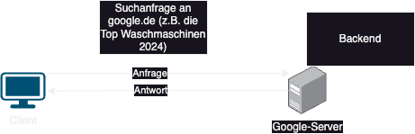

# 24-11-Wiki

## Frontend vs. Backend

- `Frontend` : Die Ansicht für den Benutzer/Benutzeroberfläche, Design und Layout. Interaktionen des Benutzers
- `Backend`: Der Benutzer sieht die Backend Services nicht bzw. interagiert damit nicht direkt
- `Client`: Das Benutzerendgerät
- `Server`: ist ein Gerät, das Anfragen von Clients verarbeitet und die angeforderten Dienste bereitstellt

## Internet

- `Internet`: Globales Netzwerk, welches die weltweite Kommunikation ermöglicht durch den Zusammenschluss von Servern ermöglicht.

## Pfade

- `absoluter Pfad`: Geht von dem Ursprung des Dateisystems aus (auf Windows wäre das `C://`)
- `relativer Pfad`:Geht von dem Verzeichnis aus, in welchem ihr euch befindet. Startet mit `./`

## Entwicklungsumgebung

- `IDE`: Die Applikation, in welcher ihr den Code entwickelt. **Visual Studio Code** wäre ein Beispiel

## Software vs. Hardware vs. Betriebssystem

- `Software`: Programm/Anwendungen. Man kann Software nicht anfassen
- `Hardware`: Physische Komponenten des Computers/Server. Zum Beispiel CPU wäre eine Hardware Komponentels
- `Betriebssystem bzw. OS`: Windows, Android, iOS. Schnittstelle zwischen Hardware und Software
- `Firmware`: Software, die direkt auf der Hardware läuft, oft fest eingebrannt, z. B. in Geräten wie Routern oder Druckern.
- `Virtualisierung`: Die Verwendung von Software, um virtuelle Versionen von Hardware-Komponenten zu erstellen, z. B. virtuelle Maschinen.

## Hardware Komponenten

- `CPU`: Central Processing Unit - Prozessor
- `RAM`: Random Access Memory - Arbeitsspeicher. Kurzzeitspeicher

## Hardware Begriffe

### 1. Prozessor (CPU)

Zentrale Recheneinheit, die Berechnungen und Aufgaben ausführt. Das "Gehirn" des Computers.

### 2. Arbeitsspeicher (RAM)

Temporärer Speicher, der Daten speichert, während sie verarbeitet werden. Daten gehen verloren, wenn der Computer ausgeschaltet wird.

### 3. Festplatte (HDD)

Mechanisches Speichermedium zur dauerhaften Speicherung von Daten.

### 4. Solid-State-Drive (SSD)

Schneller Speicher ohne bewegliche Teile, der auf Flash-Technologie basiert.

### 5. Mainboard (Motherboard)

Hauptplatine, die alle Hardware-Komponenten miteinander verbindet.

## Software Begriffe
### 1. Betriebssystem (OS)
Software, die als Schnittstelle zwischen Hardware und Anwendungen dient.
Beispiele: Windows, macOS, Linux.
### 2. Anwendungssoftware
Programme für spezifische Aufgaben, z. B. Textverarbeitung oder Bildbearbeitung.
### 3. Treiber
Software, die Kommunikation zwischen Betriebssystem und Hardware ermöglicht.
### 4. Open Source Software
Software mit offenem Quellcode, die verändert und weiterverwendet werden kann.

