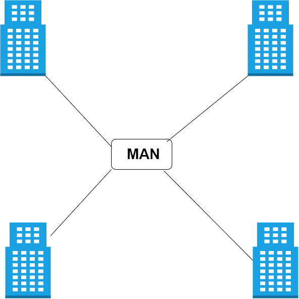
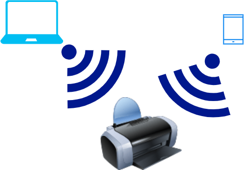
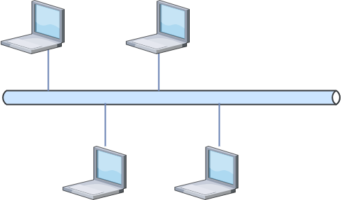
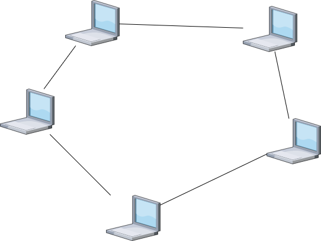
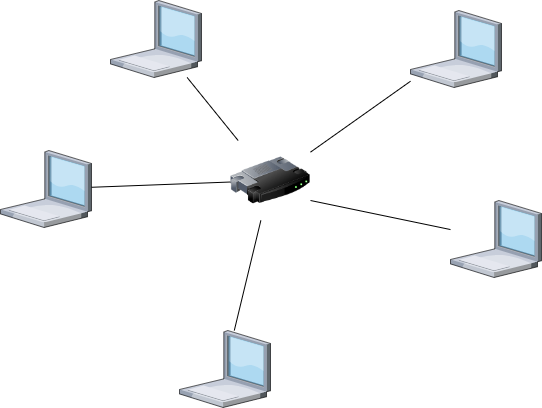
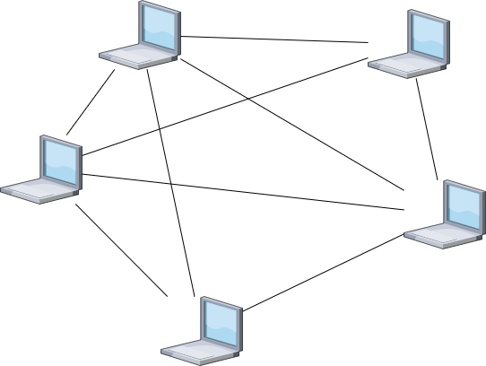

#  Netzwerkarten

## LAN (Local Area Network)

**Beschreibung:**

Ein LAN verbindet Geräte in einem kleinen geografischen Bereich, beispielsweise einem Büro oder einem Heimnetzwerk. Es zeichnet sich durch hohe Geschwindigkeit und niedrige Kosten aus, ist jedoch auf eine begrenzte Reichweite beschränkt. LANs werden häufig für die gemeinsame Nutzung von Ressourcen wie Druckern verwendet.

**Vorteile**:

Sehr hohe Datenübertragungsgeschwindigkeit.
Einfache Einrichtung und geringe Kosten.

**Nachteile**:

Begrenzte Reichweite, funktioniert nur in einem Gebäude oder eng verbundenen Räumen.

**Einsatzmöglichkeiten**:

- Heimnetzwerke für Internetnutzung.

- Büros zur gemeinsamen Nutzung von Druckern oder Dateien.

## WAN (Wide Area Network)

**Beschreibung:**

 Ein WAN deckt eine viel größere geografische Fläche ab und verbindet Netzwerke über große Entfernungen hinweg, z.B. zwischen verschiedenen Städten oder Ländern. Das Internet ist das bekannteste WAN.

**Vorteile**:

- Ermöglicht die Verbindung von Netzwerken weltweit.

- Unterstützt die Kommunikation zwischen entfernten Standorten.

**Nachteile**:

- Höhere Kosten für Einrichtung und Wartung.

- Geringere Übertragungsgeschwindigkeiten im Vergleich zu LANs.

**Eigenschaften**:

- Große geografische Reichweite.

- Kann über private oder öffentliche Verbindungen (wie das Internet) realisiert werden.

## MAN (Metropolitan Area Network)

**Beschreibung:**

Ein MAN ist ein Netzwerk, das eine größere geografische Fläche als ein LAN, aber eine kleinere als ein WAN abdeckt, typischerweise innerhalb einer Stadt.

**Vorteile**:

- Größere Reichweite als LAN, aber kostengünstiger als WAN.

- Häufig in urbanen Gebieten eingesetzt, z.B. für die Anbindung von Gebäuden.

**Nachteile**:

- Geringere Reichweite als WAN.

- Wartungskosten können hoch sein.

**Eigenschaften**:

- Deckt eine Stadt oder eine größere Region ab.

- Wird häufig von Unternehmen oder städtischen Behörden genutzt.

## PAN (Persona Area Network)

**Beschreibung:**

Ein PAN ist ein kleines Netzwerk, das Geräte im nahen Umkreis einer Person miteinander verbindet, z.B. über Bluetooth oder Wi-Fi.

**Vorteile**:

- Sehr einfach und kostengünstig einzurichten.

- Ideal für die Verbindung persönlicher Geräte.

**Nachteile**:

- Sehr geringe Reichweite.

- Sicherheitsaspekte bei der Verbindung von Geräten über Funk.

**Eigenschaften**:

- Sehr geringe geografische Reichweite (typischerweise wenige Meter).

- Verbindung von Geräten wie Smartphones, Tablets, Laptops oder anderen persönlichen Geräten.

# Netzwerktopologien

## Bus-Topologie

**Beschreibung:**

 Alle Geräte sind über ein einziges Kabel miteinander verbunden. Daten werden entlang des Kabels in beide Richtungen gesendet.

**Vorteile**:

- Günstig und einfach einzurichten.

-Weniger Kabel nötig.

**Nachteile**:

- Wenn das Hauptkabel ausfällt, ist das gesamte Netzwerk betroffen.

- Datenkollisionen können die Leistung verringern.

**Eigenschaften**:

- infache Verkabelung.

- Datenkollisionen sind wahrscheinlich, wenn viele Geräte gleichzeitig senden.

## Ring-Topologie

**Beschreibung:**

In einer Ring-Topologie sind die Geräte in einem geschlossenen Kreis miteinander verbunden. Daten zirkulieren in eine Richtung durch den Ring.

**Vorteile**:

- Hohe Datenübertragungsraten, da Daten nur in eine Richtung zirkulieren.

- Gut geeignet für kleinere Netzwerke.

**Nachteile**:

- Ein Ausfall eines Geräts oder einer Verbindung kann das gesamte Netzwerk lahmlegen.

**Eigenschaften**:

- Daten durchlaufen alle Geräte in einer festen Reihenfolge.

- Sehr gut geeignet für kleine Netzwerke.

## Stern-Topologie

**Beschreibung:**

Alle Geräte sind mit einem zentralen Knotenpunkt (z.B. einem Switch oder Router) verbunden. Der Knotenpunkt verwaltet die Kommunikation.

**Vorteile**:

- Einfach zu warten und zu erweitern.

- Sehr geringe Datenkollisionen.

**Nachteile**:

- Der Ausfall des zentralen Knotenpunkts führt zum Ausfall des gesamten Netzwerks.

**Eigenschaften**:

- Sehr weit verbreitet in modernen Netzwerken.

- Wenn der zentrale Knotenpunkt ausfällt, ist das gesamte Netzwerk betroffen.

## Mesh-Topologie

**Beschreibung:**

In einer Mesh-Topologie sind alle Geräte miteinander verbunden, sodass jedes Gerät mit jedem anderen Gerät kommunizieren kann.

**Vorteile**:

- Sehr zuverlässig, da alternative Wege zur Verfügung stehen.

- Hohe Fehlertoleranz.

**Nachteile**:

- Sehr teuer und aufwendig, sowohl in der Verkabelung als auch in der Verwaltung.

**Eigenschaften**:

- Sehr robust, da mehrere Verbindungen zwischen den Geräten bestehen.

- Erfordert viele Kabel und Ressourcen.