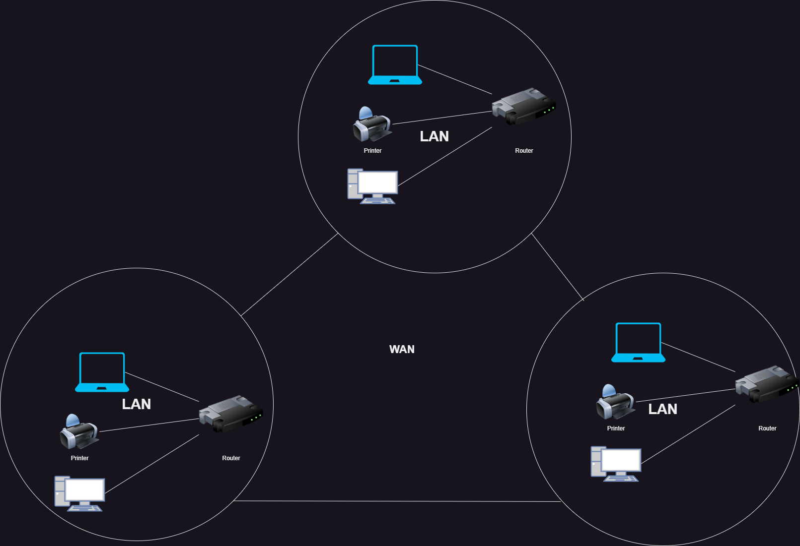

## LAN (Local Area Network)

**Beschreibung:**

Ein LAN verbindet Geräte in einem kleinen geografischen Bereich, beispielsweise einem Büro oder einem Heimnetzwerk. Es zeichnet sich durch hohe Geschwindigkeit und niedrige Kosten aus, ist jedoch auf eine begrenzte Reichweite beschränkt. LANs werden häufig für die gemeinsame Nutzung von Ressourcen wie Druckern verwendet.

**Vorteile**:

Sehr hohe Datenübertragungsgeschwindigkeit.
Einfache Einrichtung und geringe Kosten.

**Nachteile**:

Begrenzte Reichweite, funktioniert nur in einem Gebäude oder eng verbundenen Räumen.

**Einsatzmöglichkeiten**:

- Heimnetzwerke für Internetnutzung.

- Büros zur gemeinsamen Nutzung von Druckern oder Dateien.

## WAN (Wide Area Network)

**Beschreibung:**

 Ein WAN deckt eine viel größere geografische Fläche ab und verbindet Netzwerke über große Entfernungen hinweg, z.B. zwischen verschiedenen Städten oder Ländern. Das Internet ist das bekannteste WAN.

**Vorteile**:

- Ermöglicht die Verbindung von Netzwerken weltweit.

- Unterstützt die Kommunikation zwischen entfernten Standorten.

**Nachteile**:

- Höhere Kosten für Einrichtung und Wartung.

- Geringere Übertragungsgeschwindigkeiten im Vergleich zu LANs.

**Eigenschaften**:

- Große geografische Reichweite.

- Kann über private oder öffentliche Verbindungen (wie das Internet) realisiert werden.

## MAN (Metropolitan Area Network)

**Beschreibung:**

Ein MAN ist ein Netzwerk, das eine größere geografische Fläche als ein LAN, aber eine kleinere als ein WAN abdeckt, typischerweise innerhalb einer Stadt.

**Vorteile**:

- Größere Reichweite als LAN, aber kostengünstiger als WAN.

- Häufig in urbanen Gebieten eingesetzt, z.B. für die Anbindung von Gebäuden.

**Nachteile**:

- Geringere Reichweite als WAN.

- Wartungskosten können hoch sein.

**Eigenschaften**:

- Deckt eine Stadt oder eine größere Region ab.

- Wird häufig von Unternehmen oder städtischen Behörden genutzt.